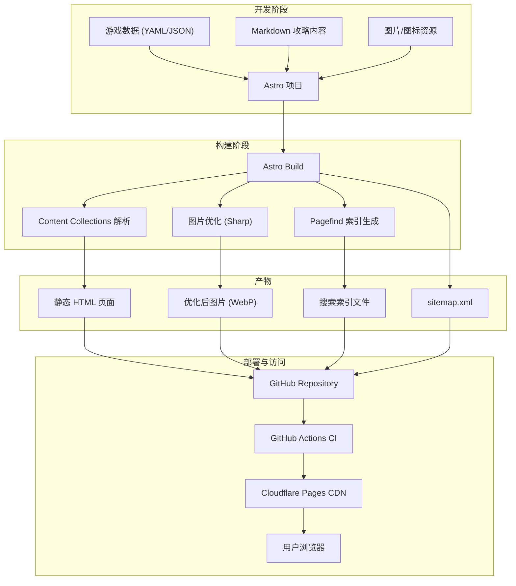
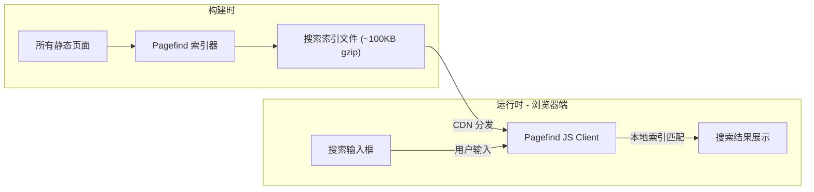

# 架构设计

## 系统架构总览



---

## 项目目录结构

```
terrapedia/
├── src/
│   ├── content/                 # 结构化数据 (Content Collections)
│   │   ├── items/               # 物品数据
│   │   │   ├── weapons/         # 武器
│   │   │   ├── armor/           # 盔甲
│   │   │   ├── accessories/     # 配饰
│   │   │   ├── consumables/     # 消耗品
│   │   │   ├── materials/       # 材料
│   │   │   └── tools/           # 工具
│   │   ├── npcs/                # NPC 数据
│   │   ├── bosses/              # Boss 数据
│   │   ├── biomes/              # 生态群落
│   │   ├── crafting/            # 合成配方
│   │   └── events/              # 事件
│   ├── components/              # UI 组件
│   │   ├── common/              # 通用组件 (Header, Footer, Nav)
│   │   ├── items/               # 物品相关组件
│   │   ├── search/              # 搜索组件 (React 岛屿)
│   │   └── crafting/            # 合成树组件
│   ├── layouts/                 # 页面布局
│   │   ├── BaseLayout.astro
│   │   ├── ItemLayout.astro
│   │   └── GuideLayout.astro
│   ├── pages/                   # 路由页面
│   │   ├── index.astro          # 首页
│   │   ├── items/               # 物品页面
│   │   ├── npcs/                # NPC 页面
│   │   ├── bosses/              # Boss 页面
│   │   ├── crafting/            # 合成配方页面
│   │   └── search.astro         # 搜索结果页
│   ├── styles/                  # 全局样式
│   └── utils/                   # 工具函数
├── public/                      # 静态资源
│   ├── images/
│   │   ├── items/               # 物品图标
│   │   ├── npcs/                # NPC 图片
│   │   ├── bosses/              # Boss 图片
│   │   └── biomes/              # 群落图片
│   ├── favicon.svg
│   └── robots.txt
├── scripts/                     # 数据处理脚本
│   ├── import-items.ts          # 物品数据导入脚本
│   └── validate-data.ts         # 数据校验脚本
├── astro.config.mjs
├── tailwind.config.mjs
├── tsconfig.json
├── package.json
└── README.md
```

---

## 数据模型设计

### 物品 (Item)

```yaml
# src/content/items/weapons/terra-blade.yaml
id: "terra-blade"
name:
  zh: "泰拉刃"
  en: "Terra Blade"
type: "weapon"
subType: "sword"
rarity: 8                        # 0-11 稀有度等级
damage: 95
damageType: "melee"              # melee | ranged | magic | summon
knockback: 6.5
useTime: 16
velocity: 12
critChance: 4                    # 额外暴击率 (%)
autoSwing: true
sellPrice:                       # 铜币为单位
  platinum: 0
  gold: 20
  silver: 0
  copper: 0
tooltip: "发射一道剑气"
obtainedFrom:
  - type: "crafting"
    recipe: "terra-blade-recipe"
  - type: "drop"
    source: "N/A"
tags: ["困难模式", "近战", "剑", "射弹"]
icon: "/images/items/terra-blade.png"
wikiUrl: "https://terraria.wiki.gg/wiki/Terra_Blade"
```

### Boss

```yaml
# src/content/bosses/eye-of-cthulhu.yaml
id: "eye-of-cthulhu"
name:
  zh: "克苏鲁之眼"
  en: "Eye of Cthulhu"
phase: "pre-hardmode"            # pre-hardmode | hardmode | post-moon-lord
order: 1                         # Boss 进度序号
maxHP: 2800
defense: 12
damage: 15
kbResistance: 100                # 击退抗性 (%)
immunities: ["着火了!", "困惑"]
summonCondition: "使用可疑眼球 或 满足自动生成条件"
summonItem: "suspicious-looking-eye"
biome: "地表"
difficulty:
  classic: { hp: 2800, damage: 15, defense: 12 }
  expert: { hp: 3640, damage: 30, defense: 12 }
  master: { hp: 4641, damage: 45, defense: 12 }
phases:
  - name: "第一阶段"
    description: "飞行冲撞，生成克苏鲁仆从"
    hpThreshold: 100
  - name: "第二阶段"
    description: "变形后快速冲撞，攻击间隔缩短"
    hpThreshold: 65
drops:
  - item: "demonite-ore"
    quantity: "30-87"
    chance: 100
  - item: "crimtane-ore"
    quantity: "30-87"
    chance: 100
  - item: "binoculars"
    quantity: 1
    chance: 33
  - item: "eye-of-cthulhu-trophy"
    quantity: 1
    chance: 10
strategy:
  arena: "宽阔的木平台，至少 3 层，间距 8-10 格"
  gear: "金/白金套装，流星套（魔法流），铁皮药水"
  tips:
    - "第二阶段冲刺速度很快，保持横向移动"
    - "使用荆棘球手榴弹可在第一阶段大量输出"
    - "带上营火和心灯增加生命恢复"
icon: "/images/bosses/eye-of-cthulhu.png"
```

### NPC

```yaml
# src/content/npcs/guide.yaml
id: "guide"
name:
  zh: "向导"
  en: "Guide"
type: "town"                     # town | special
spawnCondition: "游戏开始时自动出现"
biomePreference:
  loved: ["森林"]
  liked: []
  disliked: ["海洋"]
  hated: ["雪原"]
npcPreference:
  loved: []
  liked: ["clothier", "zoologist"]
  disliked: ["steampunker"]
  hated: ["painter"]
sells: []
specialFunction: "展示合成配方：将材料放入查询框显示可合成物品"
defenseItem: "wooden-bow"
quote: "你可以用木头合成工作台，这会让你能合成更多东西。"
icon: "/images/npcs/guide.png"
```

### 合成配方 (Crafting Recipe)

```yaml
# src/content/crafting/terra-blade-recipe.yaml
id: "terra-blade-recipe"
result:
  item: "terra-blade"
  quantity: 1
ingredients:
  - item: "true-nights-edge"
    quantity: 1
  - item: "true-excalibur"
    quantity: 1
station: "mythril-anvil"         # 制作站 ID
station_alt: "orichalcum-anvil"  # 替代制作站
```

### 生态群落 (Biome)

```yaml
# src/content/biomes/forest.yaml
id: "forest"
name:
  zh: "森林"
  en: "Forest"
layer: "surface"                 # surface | underground | cavern | hell
type: "pure"                     # pure | corruption | crimson | hallow
description: "泰拉瑞亚的默认生态群落，也是玩家出生的地方"
enemies:
  daytime: ["slime", "zombie"]
  nighttime: ["demon-eye", "zombie"]
resources: ["wood", "daybloom", "mushroom", "sunflower"]
npcsPrefer: ["guide", "merchant", "nurse"]
uniqueDrops: []
backgroundMusic: "day-overworld"
icon: "/images/biomes/forest.png"
```

---

## Content Collections 配置

```typescript
// src/content/config.ts
import { defineCollection, z } from 'astro:content';

const itemSchema = z.object({
  id: z.string(),
  name: z.object({ zh: z.string(), en: z.string() }),
  type: z.enum(['weapon', 'armor', 'accessory', 'consumable', 'material', 'tool', 'furniture', 'block', 'misc']),
  subType: z.string().optional(),
  rarity: z.number().min(0).max(11),
  damage: z.number().optional(),
  damageType: z.enum(['melee', 'ranged', 'magic', 'summon', 'throwing']).optional(),
  knockback: z.number().optional(),
  useTime: z.number().optional(),
  defense: z.number().optional(),
  sellPrice: z.object({
    platinum: z.number().default(0),
    gold: z.number().default(0),
    silver: z.number().default(0),
    copper: z.number().default(0),
  }),
  tooltip: z.string().optional(),
  tags: z.array(z.string()).default([]),
  icon: z.string(),
});

const bossSchema = z.object({
  id: z.string(),
  name: z.object({ zh: z.string(), en: z.string() }),
  phase: z.enum(['pre-hardmode', 'hardmode', 'post-moon-lord']),
  order: z.number(),
  maxHP: z.number(),
  defense: z.number(),
  damage: z.number(),
  drops: z.array(z.object({
    item: z.string(),
    quantity: z.string(),
    chance: z.number(),
  })),
  icon: z.string(),
});

export const collections = {
  items: defineCollection({ schema: itemSchema }),
  bosses: defineCollection({ schema: bossSchema }),
  // npcs, biomes, crafting 同理...
};
```

---

## 页面路由设计

| 路径 | 页面 | 数据来源 |
|------|------|----------|
| `/` | 首页 | 精选内容 + 最近更新 |
| `/items` | 物品列表 | items 集合 |
| `/items/[type]` | 物品分类列表 | items 集合（按 type 筛选） |
| `/items/[type]/[id]` | 物品详情 | 单个 item 数据 |
| `/bosses` | Boss 一览 | bosses 集合 |
| `/bosses/[id]` | Boss 详情 | 单个 boss 数据 |
| `/npcs` | NPC 列表 | npcs 集合 |
| `/npcs/[id]` | NPC 详情 | 单个 npc 数据 |
| `/crafting` | 合成配方查询 | crafting 集合 |
| `/crafting/[id]` | 合成详情 | 单个 recipe + 关联 items |
| `/biomes` | 生态群落 | biomes 集合 |
| `/biomes/[id]` | 群落详情 | 单个 biome 数据 |
| `/search` | 搜索结果 | Pagefind 客户端搜索 |

### URL 设计原则

1. **语义化**：路径直观表达页面内容
2. **层级清晰**：`/items/weapons/terra-blade` 体现分类关系
3. **SEO 友好**：使用 kebab-case，避免动态参数暴露
4. **国际化预留**：后续可添加 `/zh/` 或 `/en/` 前缀

---

## 搜索架构



### 搜索功能规格

- **索引范围**：物品名称（中英文）、描述、标签、Boss 名称、NPC 名称
- **搜索类型**：模糊匹配 + 前缀匹配
- **响应时间**：< 50ms（本地索引）
- **结果展示**：分组显示（物品/Boss/NPC/攻略），高亮匹配文本
- **联想补全**：输入时实时显示候选项

---

## 图片资源策略

### 处理流程

1. **原始图片**：从游戏资源提取的 PNG 图标
2. **构建时优化**：Astro Image 自动处理
   - 转换为 WebP 格式（体积减少 25-35%）
   - 生成多尺寸响应式图片（16px/32px/64px 图标，400px/800px 大图）
   - 自动设置 width/height 防止 CLS
3. **懒加载**：非首屏图片使用 `loading="lazy"`
4. **占位符**：低质量模糊占位（LQIP）

### 图片规格

| 类型 | 尺寸 | 格式 | 用途 |
|------|------|------|------|
| 物品图标 | 32x32 / 64x64 | WebP + PNG fallback | 列表/详情 |
| Boss 图片 | 400x400 | WebP | Boss 详情页 |
| 群落背景 | 800x400 | WebP | 群落页面 header |
| NPC 图片 | 128x256 | WebP | NPC 详情页 |
