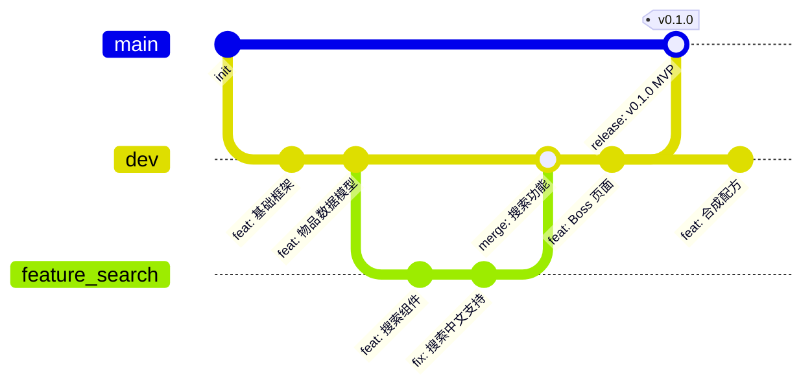

# 开发工作流

## Git 分支策略

### 三分支模型（Solo 适配版）



| 分支 | 用途 | 生命周期 |
|------|------|----------|
| `main` | 生产环境代码，始终可部署 | 永久 |
| `dev` | 日常开发主线 | 永久 |
| `feature/*` | 复杂功能开发（预计 > 1 天） | 短期，合并后删除 |
| `hotfix/*` | 紧急修复（从 main 分出） | 短期，合并后删除 |

### 分支规则

- **main** 分支只通过 `dev` 合并或 `hotfix` 合并更新，不直接 push
- **dev** 分支是日常工作分支，小改动可直接 commit
- **feature** 分支用于需要多天完成的复杂功能，完成后 merge 回 `dev`
- 所有合并使用 `--no-ff`（保留合并记录）

---

## Commit 规范

### Conventional Commits 格式

```
<type>(<scope>): <description>

[optional body]

[optional footer]
```

### Type 清单

| Type | 说明 | 示例 |
|------|------|------|
| `feat` | 新功能 | `feat(items): 添加物品详情页` |
| `fix` | Bug 修复 | `fix(search): 修复中文搜索无结果问题` |
| `data` | 数据更新 | `data(items): 新增 50 个武器数据` |
| `style` | 样式调整（不影响逻辑） | `style(layout): 调整移动端间距` |
| `refactor` | 重构（不新增功能/不修 Bug） | `refactor(utils): 抽取价格格式化工具` |
| `perf` | 性能优化 | `perf(images): 启用 WebP 懒加载` |
| `test` | 测试 | `test(items): 添加物品数据校验测试` |
| `docs` | 文档 | `docs: 更新 README 部署说明` |
| `chore` | 构建/工具链变更 | `chore: 升级 Astro 到 5.x` |
| `ci` | CI/CD 配置 | `ci: 添加 Cloudflare Pages 部署` |

### Scope 约定

| Scope | 对应模块 |
|-------|----------|
| `items` | 物品模块 |
| `bosses` | Boss 模块 |
| `npcs` | NPC 模块 |
| `crafting` | 合成配方模块 |
| `biomes` | 生态群落模块 |
| `search` | 搜索功能 |
| `layout` | 布局/导航 |
| `images` | 图片资源 |
| `seo` | SEO 相关 |
| `deploy` | 部署相关 |

### Commit Message 示例

```
feat(bosses): 添加克苏鲁之眼 Boss 攻略页

- 包含三种难度数据（普通/专家/大师）
- 掉落物品表带概率显示
- 战斗策略建议与装备推荐
```

```
data(items): 批量导入 pre-hardmode 武器数据

导入 120 件 pre-hardmode 阶段武器数据
数据来源: terraria.wiki.gg
```

---

## Code Review 流程（Solo 自审清单）

> Solo 开发者没有队友帮你 Review，所以需要用清单来系统性地自审。每次 merge 到 dev 前过一遍。

### 功能自审

- [ ] 功能是否按需求实现？对照用户故事验证
- [ ] 边界情况是否处理？（空数据、超长文本、特殊字符）
- [ ] 移动端是否正常显示？
- [ ] 暗黑模式是否适配？（V2.0 后需检查）

### 代码质量

- [ ] TypeScript 类型是否完整？有无 `any` 逃逸？
- [ ] 组件职责是否单一？是否需要拆分？
- [ ] 是否有重复代码可以抽取为工具函数？
- [ ] 命名是否清晰？（变量、函数、组件、文件名）

### 性能

- [ ] 图片是否使用了 Astro Image 优化？
- [ ] 非首屏内容是否懒加载？
- [ ] 是否引入了不必要的 JS？（Astro 岛屿架构下只在需要时引入客户端 JS）
- [ ] 构建产物体积是否合理？

### SEO

- [ ] 页面是否有正确的 title 和 description？
- [ ] 是否有适当的 heading 层级？（h1 > h2 > h3）
- [ ] 图片是否有 alt 属性？
- [ ] 结构化数据是否正确？

### 数据

- [ ] 新增数据是否通过 Schema 校验？
- [ ] 数据格式是否与既有数据一致？
- [ ] 图片引用路径是否正确？

---

## PR 模板

```markdown
## 变更类型

- [ ] 新功能 (feat)
- [ ] Bug 修复 (fix)
- [ ] 数据更新 (data)
- [ ] 样式调整 (style)
- [ ] 性能优化 (perf)
- [ ] 重构 (refactor)
- [ ] 文档 (docs)
- [ ] 其他

## 变更描述

<!-- 简述本次变更的内容和目的 -->

## 截图（如有 UI 变更）

| 变更前 | 变更后 |
|--------|--------|
|        |        |

## 自审清单

- [ ] 已通过功能自审
- [ ] 已通过代码质量检查
- [ ] 已检查移动端展示
- [ ] 已检查 SEO 要素
- [ ] ESLint / TypeScript 无报错
- [ ] 本地构建成功 (`pnpm build`)

## 关联 Issue

Closes #xxx
```

---

## 版本发布流程

### 语义化版本（SemVer）

```
v{major}.{minor}.{patch}
```

| 版本号 | 何时增加 | 示例 |
|--------|----------|------|
| major | 重大重构 / 破坏性变更 | v1.0.0 → v2.0.0 |
| minor | 新功能模块上线 | v1.0.0 → v1.1.0 |
| patch | Bug 修复 / 小数据更新 | v1.0.0 → v1.0.1 |

### 发布步骤

```bash
# 1. 确保 dev 分支稳定
git checkout dev
pnpm build && pnpm test

# 2. 合并到 main
git checkout main
git merge --no-ff dev -m "release: v0.1.0"

# 3. 打 Tag
git tag -a v0.1.0 -m "MVP: 物品数据库 + 基础搜索"

# 4. 推送（自动触发 Cloudflare Pages 部署）
git push origin main --tags

# 5. 在 GitHub 创建 Release
# 附上 changelog 和重点更新说明
```

---

## 日常开发节奏（Solo 推荐）

### 每日流程

```
1. 检查 GitHub Issues / Idea Backlog（5 min）
2. 选定今天要做的 1-2 件事
3. 在 dev 分支开发（或创建 feature 分支）
4. 完成后自审 → commit → push
5. 简短记录今日进展（可选）
```

### 每周流程

```
周一: 规划本周目标（从 Backlog 挑选 3-5 个 Issue）
周二-周五: 开发
周六: 集成测试 + 修 Bug + 数据补充
周日: 发版（如有可发布内容）+ 写周报/复盘
```

### Idea 管理

维护一个 `IDEA.md` 文件记录灵感：

```markdown
# 灵感池

## 待评估
- [ ] 添加物品对比功能（并排比较两件装备）
- [ ] 世界种子查询器
- [ ] 钓鱼攻略专题

## 已加入计划
- [x] 合成树可视化 → Issue #12

## 已否决
- ~~实时多人聊天~~ → 超出项目范围
```
