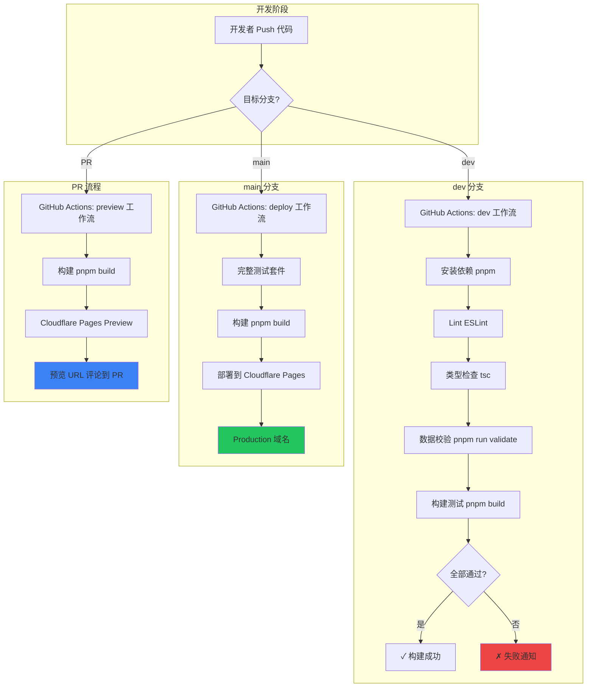
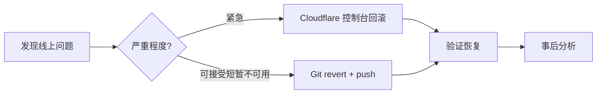

# CI/CD 与部署

本文档描述 TerraPedia（类泰拉瑞亚 Wiki）项目的持续集成/持续部署方案。技术栈：Astro SSG、Cloudflare Pages、GitHub、GitHub Actions。Solo 开发者场景。

---

## 1. CI/CD 流水线总览



### 流程说明

| 触发条件 | 工作流 | 主要步骤 | 产出 |
|----------|--------|----------|------|
| `dev` 分支 Push | `ci-dev.yml` | Lint → 类型检查 → 数据校验 → 构建 | 验证通过/失败 |
| `main` 分支 Push | `deploy.yml` | 测试 → 构建 → 部署 | Production 站点 |
| PR 创建/更新 | `preview.yml` | 构建 → 预览部署 | PR 评论中的预览链接 |

---

## 2. GitHub Actions 工作流配置

### 2.1 目录结构

```
.github/
└── workflows/
    ├── ci-dev.yml      # dev 分支：Lint + 类型检查 + 数据校验 + 构建
    ├── deploy.yml      # main 分支：完整测试 + 构建 + 部署
    └── preview.yml     # PR：预览部署
```

### 2.2 dev 分支工作流（ci-dev.yml）

```yaml
# .github/workflows/ci-dev.yml
name: CI (dev)

on:
  push:
    branches: [dev]
  pull_request:
    branches: [dev]

concurrency:
  group: ci-dev-${{ github.ref }}
  cancel-in-progress: true

jobs:
  ci:
    runs-on: ubuntu-latest
    steps:
      - name: Checkout
        uses: actions/checkout@v4

      - name: Setup pnpm
        uses: pnpm/action-setup@v4
        with:
          version: 9

      - name: Setup Node.js
        uses: actions/setup-node@v4
        with:
          node-version: '20'
          cache: 'pnpm'

      - name: Install dependencies
        run: pnpm install --frozen-lockfile

      - name: Lint
        run: pnpm run lint

      - name: Type check
        run: pnpm run check

      - name: Validate data
        run: pnpm run validate

      - name: Build
        run: pnpm run build
        env:
          NODE_ENV: production
```

### 2.3 main 分支部署工作流（deploy.yml）

```yaml
# .github/workflows/deploy.yml
name: Deploy to Cloudflare Pages

on:
  push:
    branches: [main]

concurrency:
  group: deploy-${{ github.ref }}
  cancel-in-progress: false

jobs:
  deploy:
    runs-on: ubuntu-latest
    permissions:
      contents: read
      deployments: write
    steps:
      - name: Checkout
        uses: actions/checkout@v4

      - name: Setup pnpm
        uses: pnpm/action-setup@v4
        with:
          version: 9

      - name: Setup Node.js
        uses: actions/setup-node@v4
        with:
          node-version: '20'
          cache: 'pnpm'

      - name: Install dependencies
        run: pnpm install --frozen-lockfile

      - name: Run tests
        run: pnpm run test

      - name: Build
        run: pnpm run build
        env:
          NODE_ENV: production
          PUBLIC_SITE_URL: https://terra.pedia.example.com

      - name: Deploy to Cloudflare Pages
        uses: cloudflare/wrangler-action@v3
        with:
          apiToken: ${{ secrets.CLOUDFLARE_API_TOKEN }}
          accountId: ${{ secrets.CLOUDFLARE_ACCOUNT_ID }}
          command: pages deploy dist --project-name=terra-pedia
        env:
          CLOUDFLARE_API_TOKEN: ${{ secrets.CLOUDFLARE_API_TOKEN }}
          CLOUDFLARE_ACCOUNT_ID: ${{ secrets.CLOUDFLARE_ACCOUNT_ID }}
```

### 2.4 PR 预览部署工作流（preview.yml）

```yaml
# .github/workflows/preview.yml
name: Preview Deployment

on:
  pull_request:
    branches: [main, dev]
    types: [opened, synchronize, reopened]

concurrency:
  group: preview-${{ github.head_ref }}
  cancel-in-progress: true

jobs:
  preview:
    runs-on: ubuntu-latest
    permissions:
      contents: read
      pull-requests: write
    steps:
      - name: Checkout
        uses: actions/checkout@v4

      - name: Setup pnpm
        uses: pnpm/action-setup@v4
        with:
          version: 9

      - name: Setup Node.js
        uses: actions/setup-node@v4
        with:
          node-version: '20'
          cache: 'pnpm'

      - name: Install dependencies
        run: pnpm install --frozen-lockfile

      - name: Build
        run: pnpm run build
        env:
          NODE_ENV: production

      - name: Deploy to Cloudflare Pages (Preview)
        id: deploy
        uses: cloudflare/wrangler-action@v3
        with:
          apiToken: ${{ secrets.CLOUDFLARE_API_TOKEN }}
          accountId: ${{ secrets.CLOUDFLARE_ACCOUNT_ID }}
          command: pages deploy dist --project-name=terra-pedia --branch=pr-${{ github.event.pull_request.number }}
        env:
          CLOUDFLARE_API_TOKEN: ${{ secrets.CLOUDFLARE_API_TOKEN }}
          CLOUDFLARE_ACCOUNT_ID: ${{ secrets.CLOUDFLARE_ACCOUNT_ID }}

      - name: Comment Preview URL
        uses: actions/github-script@v7
        if: success()
        with:
          script: |
            const url = '${{ steps.deploy.outputs.url }}' || '部署中，请稍候...';
            const body = `## 🌐 预览部署完成\n\n**预览地址**: ${url}\n\n> 由 Cloudflare Pages Preview 自动生成`;
            github.rest.issues.createComment({
              issue_number: context.issue.number,
              owner: context.repo.owner,
              repo: context.repo.repo,
              body: body
            });
```

### 2.5 脚本命令约定（package.json）

确保 `package.json` 中包含以下脚本：

```json
{
  "scripts": {
    "dev": "astro dev",
    "build": "astro build",
    "preview": "astro preview",
    "lint": "eslint . --ext .astro,.ts,.tsx",
    "check": "astro check",
    "validate": "node scripts/validate-data.mjs",
    "test": "vitest run"
  }
}
```

> **说明**：`validate` 脚本用于校验 `src/data/` 下的 YAML/JSON 数据是否符合 Schema，需自行实现。可参考 `02_技术选型.md` 中的 Content Collections 结构。

---

## 3. 环境管理

| 环境 | 分支/触发 | 域名 | 用途 |
|------|-----------|------|------|
| **Production** | `main` 分支 Push | `terra.pedia.example.com` | 正式对外访问 |
| **Preview** | PR 创建/更新 | `pr-123.terra-pedia.pages.dev` | 合并前验证 |
| **Local** | 开发者本地 | `localhost:4321` | 日常开发调试 |

### 3.1 Production

- 由 `deploy.yml` 自动触发
- 构建产物部署到 Cloudflare Pages 主分支
- 绑定自定义域名
- 环境变量通过 Cloudflare Dashboard 或 `wrangler.toml` 配置

### 3.2 Preview

- 由 `preview.yml` 在 PR 时触发
- 每个 PR 获得独立预览 URL
- 使用 `--branch=pr-{number}` 区分不同 PR
- 预览 URL 通过 GitHub Actions 评论到 PR

### 3.3 Local

```bash
# 启动开发服务器
pnpm dev

# Astro 默认端口 4321
# 支持热更新、Source Map、调试
```

---

## 4. Cloudflare Pages 部署配置

### 4.1 构建配置（Dashboard 或 wrangler.toml）

| 配置项 | 值 | 说明 |
|--------|-----|------|
| **构建命令** | `pnpm run build` | 或 `pnpm install && pnpm build` |
| **输出目录** | `dist` | Astro 默认输出目录 |
| **根目录** | `/` | 仓库根目录 |
| **Node 版本** | 20 | 在 Environment variables 中设置 `NODE_VERSION=20` |
| **包管理器** | pnpm | 检测 `pnpm-lock.yaml` 自动使用 |

### 4.2 wrangler.toml 示例

```toml
# wrangler.toml（可选，用于 wrangler CLI 部署）
name = "terra-pedia"
compatibility_date = "2025-01-01"
pages_build_output_dir = "dist"
```

### 4.3 环境变量管理

**在 Cloudflare Dashboard 中配置：**

1. 进入 **Pages** → **terra-pedia** → **Settings** → **Environment variables**
2. 按环境区分：Production / Preview

| 变量名 | 示例值 | 说明 |
|--------|--------|------|
| `NODE_VERSION` | `20` | 构建时 Node 版本 |
| `PUBLIC_SITE_URL` | `https://terra.pedia.example.com` | 站点绝对 URL（SEO、sitemap） |
| `PUBLIC_GA_ID` | `G-XXXXXXXX` | Google Analytics（可选） |

> **注意**：Astro 中只有以 `PUBLIC_` 开头的变量会暴露到客户端，敏感信息勿用此前缀。

### 4.4 自定义域名绑定

1. **Pages** → **terra-pedia** → **Custom domains** → **Set up a custom domain**
2. 输入域名：`terra.pedia.example.com`
3. 若域名已在 Cloudflare DNS 管理，会自动添加 CNAME 记录
4. 等待 SSL 证书签发（通常 < 5 分钟）

### 4.5 HTTP Headers 配置

在项目根目录创建 `public/_headers`（或通过 `astro.config.mjs` 的 `vite.plugins` 注入）：

```
/*
  X-Frame-Options: DENY
  X-Content-Type-Options: nosniff
  Referrer-Policy: strict-origin-when-cross-origin
  Permissions-Policy: geolocation=(), microphone=(), camera=()
```

或使用 Cloudflare **Transform Rules** → **Modify response header** 在边缘添加。

### 4.6 Redirects 配置

在项目根目录创建 `public/_redirects`：

```
# 旧路径重定向
/wiki/items/*    /items/:splat    301
/wiki/bosses/*   /bosses/:splat   301

# SPA 回退（若使用客户端路由）
/*    /404.html   404
```

Astro 也支持在 `astro.config.mjs` 中配置 redirects：

```javascript
// astro.config.mjs
export default defineConfig({
  vite: {
    plugins: [
      // 或使用 @astrojs/redirects 等插件
    ],
  },
});
```

---

## 5. 部署回滚方案

### 5.1 Cloudflare Pages 内置回滚

Cloudflare Pages 保留每次部署的历史版本，可快速回滚：

1. 进入 **Pages** → **terra-pedia** → **Deployments**
2. 找到要回滚的版本（按时间排序）
3. 点击 **...** → **Rollback to this deployment**

### 5.2 Git 回滚 + 重新部署

```bash
# 1. 回滚到上一个版本
git checkout main
git revert HEAD --no-edit
git push origin main

# 2. 或回滚到指定 commit
git revert <commit-hash> --no-edit
git push origin main
```

Push 后 GitHub Actions 会自动触发新部署。

### 5.3 回滚决策流程



---

## 6. 构建缓存策略

### 6.1 GitHub Actions 缓存

在 workflow 中利用 `actions/setup-node` 的 `cache: 'pnpm'` 自动缓存 `~/.pnpm-store`。

**显式缓存 pnpm store 与 node_modules（可选优化）：**

```yaml
- name: Get pnpm store directory
  id: pnpm-cache
  shell: bash
  run: echo "STORE_PATH=$(pnpm store path)" >> $GITHUB_OUTPUT

- name: Setup pnpm cache
  uses: actions/cache@v4
  with:
    path: ${{ steps.pnpm-cache.outputs.STORE_PATH }}
    key: ${{ runner.os }}-pnpm-store-${{ hashFiles('**/pnpm-lock.yaml') }}
    restore-keys: |
      ${{ runner.os }}-pnpm-store-

- name: Setup node_modules cache
  uses: actions/cache@v4
  with:
    path: node_modules
    key: ${{ runner.os }}-node-${{ hashFiles('**/pnpm-lock.yaml') }}
    restore-keys: |
      ${{ runner.os }}-node-
```

### 6.2 Astro 构建缓存

Astro 默认将构建缓存放在 `node_modules/.astro/`，随 `node_modules` 缓存一并生效。

**可选：单独缓存 Astro 缓存目录**

```yaml
- name: Cache Astro build
  uses: actions/cache@v4
  with:
    path: node_modules/.astro
    key: ${{ runner.os }}-astro-${{ hashFiles('**/pnpm-lock.yaml', 'src/**') }}
    restore-keys: |
      ${{ runner.os }}-astro-
```

### 6.3 缓存层级总结

| 缓存项 | 路径 | Key 依据 | 预估节省时间 |
|--------|------|----------|--------------|
| pnpm store | `~/.pnpm-store` | `pnpm-lock.yaml` | 依赖安装 30-60s |
| node_modules | `node_modules` | `pnpm-lock.yaml` | 依赖安装 20-40s |
| Astro cache | `node_modules/.astro` | lockfile + src | 构建 10-30s |

---

## 7. 自动化数据更新

### 7.1 场景说明

若 TerraPedia 的数据来源于外部（如 terraria.wiki.gg API、爬虫脚本），可通过定时任务每日/每周自动拉取并提交更新。

### 7.2 Schedule 工作流示例

```yaml
# .github/workflows/data-update.yml
name: Scheduled Data Update

on:
  schedule:
    # 每天 UTC 2:00（北京时间 10:00）
    - cron: '0 2 * * *'
  workflow_dispatch:  # 支持手动触发

jobs:
  update-data:
    runs-on: ubuntu-latest
    steps:
      - name: Checkout
        uses: actions/checkout@v4
        with:
          token: ${{ secrets.GITHUB_TOKEN }}
          ref: dev

      - name: Setup pnpm
        uses: pnpm/action-setup@v4
        with:
          version: 9

      - name: Setup Node.js
        uses: actions/setup-node@v4
        with:
          node-version: '20'
          cache: 'pnpm'

      - name: Install dependencies
        run: pnpm install --frozen-lockfile

      - name: Fetch and update data
        run: pnpm run data:fetch
        env:
          # 若有 API Key 等敏感信息，从 Secrets 注入
          WIKI_API_KEY: ${{ secrets.WIKI_API_KEY }}

      - name: Validate updated data
        run: pnpm run validate

      - name: Check for changes
        id: changes
        run: |
          git diff --quiet src/data/ || echo "changed=true" >> $GITHUB_OUTPUT
          git diff --stat src/data/ >> $GITHUB_STEP_SUMMARY

      - name: Commit and push
        if: steps.changes.outputs.changed == 'true'
        run: |
          git config user.name "github-actions[bot]"
          git config user.email "github-actions[bot]@users.noreply.github.com"
          git add src/data/
          git commit -m "data: 定时更新游戏数据 [skip ci]"
          git push origin dev
```

### 7.3 数据拉取脚本约定

在 `package.json` 中增加：

```json
{
  "scripts": {
    "data:fetch": "node scripts/fetch-wiki-data.mjs"
  }
}
```

`scripts/fetch-wiki-data.mjs` 伪代码示例：

```javascript
// scripts/fetch-wiki-data.mjs
import { writeFileSync } from 'fs';
import { join } from 'path';

// 1. 从 API/爬虫获取数据
const items = await fetchFromWikiAPI();

// 2. 转换为项目数据格式
const transformed = transformToSchema(items);

// 3. 写入 src/data/items/*.yaml 或 *.json
for (const item of transformed) {
  const path = join(process.cwd(), 'src/data/items', `${item.id}.yaml`);
  writeFileSync(path, toYAML(item), 'utf-8');
}
```

### 7.4 注意事项

- 使用 `[skip ci]` 避免 data commit 再次触发 CI（可选，若希望 data 更新也跑一遍 CI 可去掉）
- 敏感凭证（API Key）存入 **Settings** → **Secrets and variables** → **Actions**
- Schedule 受 GitHub 免费额度限制（每月约 2000 分钟），单次任务控制在数分钟内
- 建议先合并到 `dev`，经人工确认后再 merge 到 `main` 触发生产部署

---

## 附录：GitHub Secrets 配置清单

| Secret 名称 | 说明 | 获取方式 |
|-------------|------|----------|
| `CLOUDFLARE_API_TOKEN` | Cloudflare API Token | [Cloudflare Dashboard](https://dash.cloudflare.com/profile/api-tokens) → Create Token，需 Pages 编辑权限 |
| `CLOUDFLARE_ACCOUNT_ID` | Cloudflare 账户 ID | Dashboard 右侧边栏 |
| `WIKI_API_KEY` | 外部数据源 API Key（可选） | 数据提供方 |

---

## 附录：快速检查清单

部署前确认：

- [ ] `pnpm run build` 本地可成功执行
- [ ] `pnpm run validate` 数据校验通过
- [ ] GitHub Secrets 已配置 `CLOUDFLARE_API_TOKEN`、`CLOUDFLARE_ACCOUNT_ID`
- [ ] Cloudflare Pages 项目已创建，名称与 workflow 中 `--project-name` 一致
- [ ] 自定义域名已绑定（若使用）
- [ ] `_headers`、`_redirects` 已放入 `public/` 或通过构建生成
