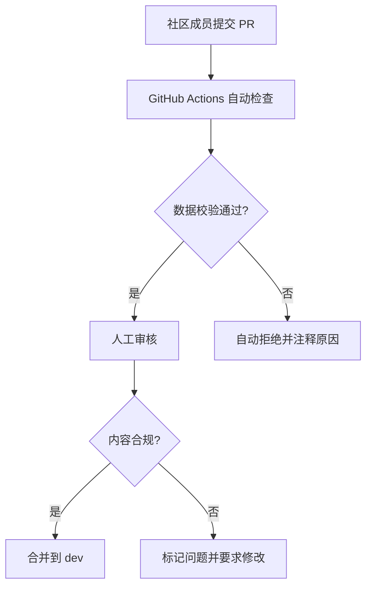

# 安全方案

## 安全概述

TerraPedia 作为静态站点（SSG），安全风险相对动态应用大幅降低——无服务端运行时、无数据库、无用户输入处理。但仍需在以下几个层面建立防护。

---

## 威胁模型

| 威胁 | 风险等级 | 适用阶段 | 说明 |
|------|---------|----------|------|
| XSS 跨站脚本 | 低 | MVP+ | 静态站点无用户输入，但第三方脚本可能引入风险 |
| 供应链攻击 | 中 | MVP+ | npm 依赖可能被注入恶意代码 |
| DNS 劫持 | 低 | MVP+ | 域名被劫持指向恶意站点 |
| DDoS 攻击 | 低 | V1.0+ | CDN 天然抗 DDoS，但需配置 |
| 代码仓库泄露 | 中 | MVP+ | API Key、密钥等敏感信息泄露 |
| 内容篡改 | 低 | V2.0+ | 社区贡献可能引入恶意内容 |

---

## HTTP 安全头配置

### Cloudflare Pages `_headers` 文件

```
/*
  X-Frame-Options: DENY
  X-Content-Type-Options: nosniff
  X-XSS-Protection: 1; mode=block
  Referrer-Policy: strict-origin-when-cross-origin
  Permissions-Policy: camera=(), microphone=(), geolocation=()
  Content-Security-Policy: default-src 'self'; script-src 'self' 'unsafe-inline' https://static.cloudflareinsights.com; style-src 'self' 'unsafe-inline'; img-src 'self' data: https:; font-src 'self' https://fonts.gstatic.com; connect-src 'self'
  Strict-Transport-Security: max-age=31536000; includeSubDomains; preload
```

### 各安全头说明

| Header | 作用 |
|--------|------|
| `X-Frame-Options: DENY` | 禁止被 iframe 嵌入，防止点击劫持 |
| `X-Content-Type-Options: nosniff` | 禁止 MIME 类型嗅探 |
| `Referrer-Policy` | 控制 Referer 头泄露范围 |
| `Permissions-Policy` | 禁用不需要的浏览器 API（摄像头、麦克风等） |
| `CSP` | 白名单控制可执行脚本/样式/资源来源 |
| `HSTS` | 强制 HTTPS，防止降级攻击 |

---

## 依赖安全

### 自动化依赖审计

```yaml
# .github/workflows/security-audit.yml
name: Security Audit

on:
  schedule:
    - cron: '0 8 * * 1'  # 每周一 08:00 UTC
  push:
    paths:
      - 'pnpm-lock.yaml'

jobs:
  audit:
    runs-on: ubuntu-latest
    steps:
      - uses: actions/checkout@v4
      - uses: pnpm/action-setup@v4
      - run: pnpm audit --audit-level=high
      - name: Check for known vulnerabilities
        run: npx audit-ci --high
```

### 依赖管理最佳实践

| 实践 | 说明 |
|------|------|
| 锁定版本 | 使用 `pnpm-lock.yaml` 锁定精确版本 |
| 最小化依赖 | 只安装必要依赖，避免"依赖膨胀" |
| Dependabot | 启用 GitHub Dependabot 自动更新安全补丁 |
| 审查新依赖 | 添加新包前检查：下载量、维护状态、已知漏洞 |

### Dependabot 配置

```yaml
# .github/dependabot.yml
version: 2
updates:
  - package-ecosystem: "npm"
    directory: "/"
    schedule:
      interval: "weekly"
    open-pull-requests-limit: 5
    labels:
      - "dependencies"
    reviewers:
      - "your-github-username"
```

---

## 代码仓库安全

### 敏感信息防泄露

```gitignore
# .gitignore 安全相关条目
.env
.env.*
*.pem
*.key
credentials.json
scripts/dev/local-stack.config.json
!**/.env.example
```

### Git Secrets 扫描

```yaml
# 在 CI 中添加 secret 扫描
- name: Scan for secrets
  uses: trufflesecurity/trufflehog@main
  with:
    path: ./
    base: ${{ github.event.repository.default_branch }}
    extra_args: --only-verified
```

### GitHub 仓库安全设置

| 设置 | 推荐值 |
|------|--------|
| 分支保护 (main) | 启用：要求 CI 通过 |
| Secret scanning | 启用 |
| Dependabot alerts | 启用 |
| Push protection | 启用（阻止推送包含密钥的 commit） |

---

## Cloudflare 安全配置

### DNS 安全

| 配置 | 说明 |
|------|------|
| DNSSEC | 启用，防止 DNS 响应篡改 |
| 代理模式 | 启用（橙色云朵），隐藏源 IP |

### DDoS 防护

Cloudflare Pages 自带 DDoS 防护，免费套餐包含：
- Layer 3/4 DDoS 防护
- Layer 7 DDoS 缓解
- Rate Limiting（可选配置）

### WAF 规则（V1.0+ 按需启用）

```
# 阻止可疑的 User-Agent
Block: User-Agent contains "sqlmap" OR "nikto" OR "nmap"

# 国家/地区限制（如果只面向中文用户，可考虑）
# 注意：这会影响海外用户访问
```

### 缓存安全

```
# _headers
/images/*
  Cache-Control: public, max-age=31536000, immutable

/*.html
  Cache-Control: public, max-age=0, must-revalidate
```

---

## 内容安全（V2.0 社区贡献阶段）

### 贡献审核流程



### 内容校验规则

| 规则 | 说明 |
|------|------|
| Schema 校验 | 贡献的数据必须通过 Zod schema 验证 |
| 图片校验 | 只允许 PNG/WebP/SVG 格式，文件大小 < 500KB |
| 文本校验 | 检查是否包含外部链接（需白名单机制） |
| 重复检测 | 检查是否与已有数据 ID 冲突 |

---

## 安全检查清单

### MVP 阶段

- [ ] `_headers` 安全头配置完成
- [ ] HTTPS 强制启用
- [ ] `.gitignore` 包含敏感文件
- [ ] 无硬编码密钥在代码中
- [ ] Dependabot 启用
- [ ] GitHub Secret scanning 启用

### V1.0 阶段

- [ ] CSP 策略细化并测试
- [ ] DNSSEC 启用
- [ ] 依赖审计 CI 就绪
- [ ] Lighthouse 安全审计通过
- [ ] 404 / 错误页面不泄露技术栈信息

### V2.0 阶段

- [ ] PR 自动内容审查流程就绪
- [ ] 贡献者权限分级
- [ ] 恶意内容检测机制
- [ ] 安全事件响应预案文档化

---

## 安全事件响应预案

### 事件分级

| 级别 | 定义 | 示例 | 响应时间 |
|------|------|------|----------|
| P0 紧急 | 站点被篡改 / 用户数据泄露 | 恶意代码注入 | < 1 小时 |
| P1 高 | 依赖存在已知高危漏洞 | npm 包被投毒 | < 24 小时 |
| P2 中 | 配置错误导致信息泄露 | 源码 map 泄露 | < 72 小时 |
| P3 低 | 非关键安全告警 | 低危依赖漏洞 | 下次迭代修复 |

### 响应步骤

1. **确认**：验证安全事件真实性
2. **隔离**：回滚到最近的安全版本（Cloudflare Pages 一键回滚）
3. **修复**：定位并修复漏洞
4. **验证**：确认修复有效，无遗留风险
5. **复盘**：记录事件始末和改进措施
